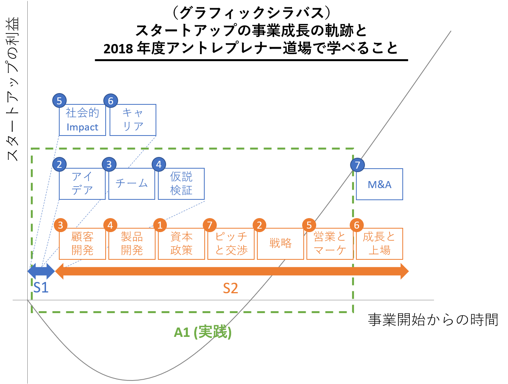

本ページでは、東京大学アントレプレナーシップ道場の受講生向けのページです。既にアントレ道場に受講登録をされている方向けに、詳しい情報を提供します。

登録前に必要な情報は [http://www.ducr.u-tokyo.ac.jp/activity/venture/education/dojo.html](http://www.ducr.u-tokyo.ac.jp/activity/venture/education/dojo.html) を確認してください。

## アントレプレナーシップとは

2018年度のアントレ道場におけるアントレプレナーシップの定義は「**自らのコントロール可能な範囲を越えて好機とリソースを追い求め、社会の課題を解決することにより新たな価値を創造して、それを維持可能な形で提供し続けること**」と定めています。

これは Harvard Business School の教授である Stevenson の “Entrepreneurship is the pursuit of opportunity beyond the resources you currently control” (Stevenson 1983, 1985, 1990) を参考にしたものです。今回はこれに加えて、社会課題の解決による価値の創造と、持続可能な形で提供すること（多くの場合は経済的利益を得てビジネスとして維持できること）を条件として付けくわえています。

アントレプレナーシップは起業の領域に限る話ではなく、新規事業やその他の活動にも必要になってくる精神性です。ただアントレプレナー道場では、急成長を志向する「スタートアップ」という起業の一形態におけるアントレプレナーシップについて中心に伝えていきます。

## 授業の構成

2018年度のアントレプレナー道場は 3 つのセメスターに分かれて開講しています。それぞれのセメスターでは以下のような授業構成となっています。

|S| 内容 |
| --- | --- |
| S1 | スタートアップの考え方やアイデアの見つけ方 |
| S2 |スタートアップを成長させるための知識やスキル  |
| A1 | 学んできたものを実践する |

その中でも S1, S2 は、これまでスタートアップに触れたことがないような学生の皆さん向けに、座学中心の内容となっています。

今すぐ実践を通して学びたい、という場合は、他のプログラムである以下のプログラムなどを活用してください。

- 数万円の開発補助費が出る「[本郷テックガレージ Project Fund](https://www.hongotechgarage.com/project/)」
- 夏休みに実際のモノづくりを通して学ぶ「[Summer Founders Program](http://www.ducr.u-tokyo.ac.jp/activity/venture/sfp.html)」
- モノを作って SXSW に持っていく「[Todai to Texas](http://todaitotexas.com)」
- 技術シーズの事業化を担う「[EDGE Next](https://www.ducr.u-tokyo.ac.jp/activity/venture/education/edge.html)」

## Quick Links

- [提出済みスタートアップチェックサーチ](./search/)
- [アントレ道場 2018 Scrapbox](https://scrapbox.io/entre2018/)
- [アントレ道場 Slack](https://entredojo2018.slack.com/) ([iPhone App](https://itunes.apple.com/jp/app/slack/id618783545?mt=8)/[Android App](https://play.google.com/store/apps/details?id=com.Slack&hl=ja))
- [アントレ道場公式 Web ページ](http://www.ducr.u-tokyo.ac.jp/activity/venture/education/dojo.html)

## 宿題

今年度のアントレプレナー道場ではいくつかの宿題を用意しています。毎週 30 分から1時間程度かかることを想定してください。

これは履修登録以外の人も実施をお願いします。

### S1 での宿題

| 回 | Assignments | Additional |
| --- | --- | --- |
| 4/11 | [サーベイ 1 個 (4/16 23:59 締切)](https://goo.gl/forms/CVl1qFfMwiEG3v3N2)   評価（各自メールをチェック、4/23 23:59 締切） | [宿題のヒント](./homework/)   [Pre-UTokyo 1000k 移動と輸送](https://goo.gl/forms/c3zJzKDAIPx0vPOv2) |
| 4/18 | [サーベイ 2 個 (4/23 23:59 締切)](https://goo.gl/forms/24Qdk1aMx45LORaD3)   評価（各自メールをチェック、4/30 23:59 締切） | [宿題のヒント](./homework/)   [Pre-UTokyo 1000k 医療とヘルスケア](https://goo.gl/forms/Xnx4Lfu5LtYwEqbA3) |

## 配布物や資料

### S1 での配布物や資料

| 回 | Handouts | 授業資料 |
| --- | --- | --- |
| 4/11 | なし | [資料](https://drive.google.com/open?id=1vA5hSDBWT1POn402DxZt700uURvyi9hC) |

## キーワード

本授業のキーワードです。

ジョブ、プログレス、プロジェクトマネジメント、BMLループ、仮説検証、カンバン (Kanban / kanban)、WIP、TOC、スループット、ボトルネック、リスクマネジメント、スケジュール、フロー効率性とリソース効率性、リードタイム、ゆとり、リフレクション、KPT、モメンタム、リズム、規律、アイデア、リサーチ、観察、サーベイ、顧客開発、インタビュー手法、リーンスタートアップ、リーンキャンバス、プロダクト、メトリクス、マジックモーメント、ファシリテーション、UX、カスタマージャーマップ、スケーリング（グロース）、グロースハック、プロダクトマーケットフィット (Product/Market Fit: PMF)、研究開発、開発方法論、知財戦略、特許、イノベーションのジレンマ、調達活動、学習、プロトタイピング、インベンションとイノベーション、B2C マーケティング、B2B マーケティング、STP、4P、セールス、初期顧客獲得、リードジェネレーション、契約、カスタマーサクセス、ビジネスモデル、サポート、パートナーシップ、規制、ロビイング活動、3C、ビジネスモデル、バリューチェーン、競争優位性、戦略キャンバス、戦略マップ、ビジョン、資源の調達（採用、資金）、投資家の仕組み、ピッチ、創業株主間契約、共同創業者マネジメント、チーム、フィードバック手法、採用、心理的安全性、OKR、1 on 1、リーダーシップ、ミッション、ビジョン、バリュー、文化

## 補講と関連イベント

以下の日程でオフィスアワーや関連イベントを実施します。参加者は必ず事前に登録してください。

| 日付 | 内容 |
| --- | --- |
| 4/12 (木) 18:00 - 18:30 | [Pre-UTokyo 1000k 説明会](https://www.eventbrite.com/e/pre-utokyo-1000k-tickets-44974153905) |
| 4/16 (月) 19:00 - 20:00 | [サーベイ宿題に関する Q&A](https://www.eventbrite.com/e/qa-tickets-44750538064) |

## グラフィックシラバス

コースの全体像です。企業の成長と講義の内容をマップしています。

数字は何回目かの講義を示しています。S1 では主にスタートアップの初期を、S2 では初期から中期にかけて必要となる知識をゲスト講師とともに説明していきます。

## Pre-UTokyo 1000k について

アントレ道場の直後に、UTokyo 1000k の一環のプログラムである Pre-UTokyo 1000k を実施します。

Pre-UTokyo 1000k では毎週異なるテーマに対してピッチコンテストを行い、優勝したアイデアに 5 万円の副賞を提供します。

### 締切とフォーム

| 締切 | テーマ | 応募フォーム | 発表会 |
| --- | --- | --- | --- |
| 4/16 (月) | 移動と輸送 | [応募フォーム](https://goo.gl/forms/c3zJzKDAIPx0vPOv2) | 4/18 (水) 20:30 ～ 21:00 |
| 4/23 (月) | 医療とヘルスケア | [応募フォーム](https://goo.gl/forms/Xnx4Lfu5LtYwEqbA3) | 4/25 (水) 20:30 ～ 21:00 |
| 4/30 (月) | お金と社会保障 | [応募フォーム](https://goo.gl/forms/XZIaSf5tEzlpjLNy1) | 5/2 (水) 20:30 ～ 21:00 |
| 5/7 (月) | エネルギーと資源 | [応募フォーム](https://goo.gl/forms/ZkUFw9cjYZilldWm1) | 5/9 (水) 20:30 ～ 21:00 |
| 5/14 (月) | 生活、家事、都市 | [応募フォーム](https://goo.gl/forms/YseMruKLAoSE6IQ83) | 5/16 (水) 20:30 ～ 21:00 |
| 5/21 (月) | 大学教育と働き方  | [応募フォーム](https://goo.gl/forms/0pEd23EVP4uFVo8s1) | 5/23 (水) 20:30 ～ 21:00 |

### pre-1000k のアイデアの条件

- 現在利用可能なテクノロジを利用すること（実現不可能なアイデアはNG）
- シェアリングビジネスやマッチングビジネス、人材紹介業、クラウドファンディング以外のアイデアであること

### Pre-1000k の進め方

- 賞金は毎週 5 万円
- 基準を超えるものがなければ 1000k Pitch の賞金に繰り越し加算します
- プロダクトのアイデアを特定のフォーマット (https://www.slideshare.net/takaumada/startup-pitch-template3min) に落とし込んでください
- 毎週月曜日EODに締切です
- 火曜日に3チーム選出します。スライド修正は水曜日 12:00 までです。必ず事前提出していただきます。
- 毎週水曜日 20:30 から3チームが3分ずつピッチして、ゲスト講師と先生方が評価します（Q&Aはナシ、最終講評のみ）
- 審査員が評価中に来週のテーマ解説とスタートアップの例を紹介します

## UTokyo 1000k

### 概要

[オフィシャルWebページはこちら](https://www.ducr.u-tokyo.ac.jp/activity/venture/utokyo1000k.html)です。

| 日程 | 時間 | マイルストーン |
| --- | --- | --- |
| 5/31 (木) | 23:59 | 最終締め切り |
| 6/2 (土) | 13:00 ～ 20:00 | 一次審査 Pitch |
| 6/9 (土) | 10:00 ～ 13:00 | Semi-Final Pitch |
| 6/9 (土) | 15:00 ～ 20:00 | Final Pitch |

#### 技術部門

賞金：50 万円

東大発の研究や技術が入っていること

#### テーマ部門

賞金：10 万円

「時間を作り出すアイデア」

## Readings

アントレプレナー道場では、各回の内容を補助するための文献をいくつか提示します。必ず読む必要はありませんが、**授業前に**これらの文献を読んでおくと、授業の内容を深く理解できるようになるでしょう。

特にゲスト講演を聞く前に事前知識があるかどうかは大きな違いとなります。ぜひ興味のある人は事前にこれらの文献の一部を読んでみていただければと思います。

### Week 1 (4/11) / アイデア

#### Books

**[アイデアのつくり方](http://amzn.asia/cMJMHZL)**
アイデアを生み出すために材料を集めることや、それらを組み合わせることの重要性を語っています。（馬田）

**[アイデア大全](http://amzn.asia/fEs6XMC)**
発想法のサマリーとして有用です（馬田）

**[イノベーションのアイデアを生み出す七つの法則](http://amzn.asia/cvptscT)**
上記まではビジネス系のアイデアが主となりますが、この本は科学的発見につながるアイデアもふくめて、組み合わせや隣接可能性というキーワードで語っています。サマリーとして使える[著者による TED の講演](http://www.ted.com/talks/lang/ja/steven_johnson_where_good_ideas_come_from.html)もあります。（馬田）

**[ジョブ理論 イノベーションを予測可能にする消費のメカニズム](http://amzn.asia/2Sd4tjC)**
クリステンセンによる「ジョブ」の考え方が解説された本です。ジョブに関する考え方はこちらの本にあたってみてください。（馬田）

**[Jobs to be Done](http://amzn.asia/hhZFvRN)**
クリステンセンのジョブ理論に影響を与えたと言われている Ulwick の本です。Job Statement や Outcome Statement はこの本を参照してみてください（馬田）

**[ソーシャル物理学:「良いアイデアはいかに広がるか」の新しい科学](http://amzn.asia/csjeNzV)**
アイデアの広がり方について人の行動をベースにして研究した内容がまとめられています。皆が平等な時間話すことが大事であるなどの実践的な知見もあります。（馬田）

**[イノベーションと企業家精神](http://amzn.asia/fTtf6Pf)**
ドラッカーは彼の独特な整理により、ある種の示唆を得られるときがあるので読んでみても良いのではないかと思います。（馬田）

#### Articles

**[スタートアップの始め方とスタートアップを始める理由 (Startup School #01 翻訳)](https://medium.com/startup-school-2017-jp/how-and-why-to-start-a-startup-385b489839bf)**
Y Combinator が 2017 年に実施したオンラインスクールの書き起こしです。馬田が許可を取って翻訳しました。（馬田）

**[Lecture 1: Welcome, and Ideas, Products, Teams and Execution Part I](http://startupclass.samaltman.com/courses/lec01/)**
Y Comnbinator の現在の社長である Sam Altman によるスタートアップのアイデアの見つけ方などです。（馬田）

**[Paul Graham - How to Get Startup Ideas](http://www.paulgraham.com/startupideas.html)**
Y Commbinator の創業者である Paul Graham によるアイデアの見つけ方についてのエッセイです。日本語翻訳は[こちら](https://medium.com/@yamotty/how-to-get-startup-ideas-いかにスタートアップのアイデアを得るか-ca6fe7e01712)。（馬田）

**[Growth](http://startupclass.samaltman.com/courses/lec06/)**
Facebook の VP of Growth による事業成長の方法についてです。Magic Moment はこの授業で詳しく解説されています。（馬田）

**[Intercom on Jobs to be done](https://www.intercom.com/books/jobs-to-be-done)**
スタートアップである Intercom による Jobs to be done の解説資料です。（馬田）

**[ペルソナかJobs-to-Be-Doneか
](https://u-site.jp/alertbox/personas-jobs-be-done)**
従来のペルソナやニーズといった概念と job の概念がどう違っていて、どう同じなのかを考えるうえで参考になる記事です。（馬田）

### Week 2 (4/18) / スタートアップを始める前に

#### Books

**[テクノロジー・スタートアップが未来を創る: テック起業家をめざせ](http://amzn.asia/cDvYxoJ)**
ゲスト講師である鎌田さんの著作です。（馬田）

**[Founders at Work 33のスタートアップストーリー](http://amzn.asia/gDJr5zi)**
Y Combinator の共同創業者である Jessica による創業者たちへのインタビュー集です。今は大企業となったスタートアップの創業者たちの若いころのインタビューが読めます。（馬田）

**[Airbnb Story](http://amzn.asia/5Pyy6c4)**
大学を卒業したばかりの Airbnb の創業者たちがどうやって今の大きさの事業を立てたのか、そしてその創業当初はどうだったのかを描いた書籍です。（馬田）

**[本田宗一郎　夢を力に　私の履歴書]( http://amzn.asia/ffaj4xM)**
HONDA の創業者である本田宗一郎氏による自伝です。6年間のアート商会（本郷湯島五丁目にあった自動車修理工場）での丁稚奉公の話から、のれん分けして浜松へ、東海精機株式会社でのピストンリング製造からこの会社のトヨタへの会社の売却、そしてすぐに本田技研を設立する、という会社の成り立ちが本人の目線で語られます。（馬田）

**[Made in Japan]( http://amzn.asia/dIOmByr)**
SONY の創業者である盛田昭夫氏による振り返りの書籍です。戦後、大学の講師をしながら SONY を立ち上げた話や、SONY の初期のエンジニアたちの話を読みたいときにも便利な本です。（馬田）

**[勉強の哲学](http://amzn.asia/gvHcqm5)**
「バカ」になることはスタートアップでも求められます。勉強の意義を現代風に理解するときに役立つ見方ではないでしょうか。（馬田）

#### Articles

**[起業の前に (Paul Graham)](https://practical-scheme.net/trans/before-j.html)**
Y Combinator の創設者である Paul Graham による、2015 年の Stanford University でのレクチャーです。大学時代には起業せず、興味深い何かについて誰かと一緒にやってみることがお勧めされています。（馬田）

**[これは水です](https://j.ktamura.com/this-is-water)**
David Foster WallaceがKenyon大学で行った卒業スピーチの日本語での書き起こしです。リベラルアーツは「自分の頭で考えること」を促してくれますが、それはスタートアップを考えるうえで重要なことのように思えます。（馬田）

**[スタートアップを始める前に](https://www.slideshare.net/takaumada/why-not-start-a-startup)**
馬田によるスライドです。（馬田）

**[SONY History](https://www.sony.co.jp/SonyInfo/CorporateInfo/History/SonyHistory/)**
「ソニー自叙伝」の一部抜粋です。SONY の初期のころを簡単に読みたいときはこちらが便利です。（馬田）

**[MIT 講演「ハードテック・スタートアップの始め方」 のメモ](https://medium.com/@tumada/mit-講演-ハードテック-スタートアップの始め方-のメモ-988176be568a)**
大学のシーズなどを活かした技術系のスタートアップを始めるときには、この Sam Altman による MIT での講演が示唆的ではないかと思います。（馬田）

### Week 3 (4/25) / チーム

#### Books

**[起業家はどこで選択を誤るのか――スタートアップが必ず陥る9つのジレンマ](http://amzn.asia/dOQkkTH)**
起業家個々人についてデータで語る書籍の中で最もまとまっている書籍の一つです。さらにそこから実務的な示唆も提供してくれます。3Rフレームワークなどはこちらの本からです。（馬田）

**[Team Geek ―Googleのギークたちはいかにしてチームを作るのか](http://amzn.asia/a0Ar8r2)**
Google のとあるチームで実践されている良いチームの作り方について。http://amzn.asia/2uIIm2CHumility, Respect, Trust を重視する HRT フレームワークや「」といった言葉が印象的です。（馬田）

**[チームワークの心理学: エビデンスに基づいた実践へのヒント](http://amzn.asia/1wsdyMv)**
チームワークに関しては著者個人の実体験に基づく、サンプル数の少ない中での成功例が多いですが、この本は一貫してエビデンスをベースにして書かれており、何かしらの裏付けが欲しい時に役立つ本です。（馬田）

**[ORIGINALS 誰もが「人と違うこと」ができる時代](http://amzn.asia/7LtDc1T)**
Wharton の Adam Grant による、オリジナリティのある人の傾向について。オリジナルな人は思っているよりもずっと普通であることを教えてくれます。たとえばリスクを嫌ったり計算したりする起業家のほうが成功しやすいなど、研究をベースにした理知的な指摘が溢れています。（馬田）

**[HARD THINGS](http://amzn.asia/haKaLea)**
Andreessen Horowitz の共同創業者である Ben Horowitz がスタートアップを経営していた時代に起こった「困難なこと」と、それに対してどう考えて行動したかが書かれています。人に関するハードなことが多いので一読をお勧めします。（馬田）

**[ビジョナリー・カンパニー 2 - 飛躍の法則](http://amzn.asia/gStZliM)**
「誰をバスに乗せるか」という言葉を広めた書籍であり、起業の際にも参考になるでしょう。

**[賢い組織は「みんな」で決める:リーダーのための行動科学入門](http://amzn.asia/4APpzsC)**
サンスティーンによる集団における意思決定を取り扱った本です。チーム運営でも重要です。

**[愛するということ](http://amzn.asia/3i7NltP)**
共同創業者や投資家は結婚相手に近いと言われますが、結婚を考えるうえでこの本は一つの参考になるはずです。（馬田）

**[夫婦ゲンカで男はなぜ黙るのか](http://amzn.asia/j4IFFvu)**
同じく結婚の本ですが、様々な研究をベースにどうすればよい関係性を築けるかが書かれており、共同創業者間での関係性においても示唆を与えてくれると思います。（馬田）

**[組織デザイン](http://amzn.asia/airM9VV)**
沼上先生の『組織戦略の考え方』も同様にお勧めです。（馬田）

**[チームが機能するとはどういうことか――「学習力」と「実行力」を高める実践アプローチ](http://amzn.asia/9ddRTH8)**
心理的安全について提唱したエドモンドソンの著作です。（馬田）

**[ワーク・モティベーション](http://amzn.asia/70Fda6L)**
目標設定理論を唱えたレイサムによる、モチベーションに関する理論の総括の書です。チーム運営の際に役立つ知識が詰まっています。（馬田）

#### Articles

**[スタートアップのアドバイザーへの株は 0.1% ぐらいからで](https://medium.com/@tumada/startup-advisor-equity-01-7ba85a4ddfcc)**
共同創業者として偉い人が入る場合、本当にフルタイムでやってくれる共同創業者なのか、単なるアドバイザーなのかははっきりしておくべきでしょう。アドバイザーの場合、渡す株は少数で構いませんし、基本は出資を求めてください。（馬田）

**[スタートアップ共同創業者の見つけ方、付き合い方、別れ方](https://www.slideshare.net/takaumada/how-to-find-your-best-cofounder)**
昔に馬田が書いたスライドです。共同創業者を考えるうえでのデータなどを提供しています。（馬田）

**[スタートアップの"共同創業者"を選ぶ技術](https://www.slideshare.net/takaumada/startup-cofounder-skill)**
こちらは最近馬田が書いたスライドです。（馬田）

**[re:Work](https://rework.withgoogle.com)**
Google による、自社でのデータを活かした人材活用方法についてです。チームマネジメントの参考になる知見がたくさん含まれています。（馬田）

### Week 4 (5/2) / アイデアの検証

#### Books

**[リーンスタートアップ](http://amzn.asia/ihb31Yw)**
科学に近い、仮説検証の方法を用いてスタートアップのリスクを検証していく方法論が説かれた、エポックメイキングなスタートアップに関する本です。Web やスマホをベースとしたスタートアップで特に有効な考え方です。（馬田）

**[リーン顧客開発 ―「売れないリスク」を極小化する技術](http://amzn.asia/683UiVG)**
リーンスタートアップシリーズの本のなかで、特に顧客インタビューについて重点的に書かれた本です。顧客インタビューは顧客の課題を見つけるうえでも最も基本的なスキルとして身に着けておくと良いと思います。（馬田）

**[アントレプレナーの教科書]( http://amzn.asia/hO7jfMS)**
Steve Blank による顧客開発の方法論が説かれた本です。すべてを読むのは難しいので、最初の2ステップである顧客発見と顧客実証を中心に読んでみると参考になるでしょう。（馬田）

**[SPRINT 最速仕事術――あらゆる仕事がうまくいく最も合理的な方法](http://amzn.asia/jaKSqSU)**
Design Sprint の手法をビジネスの広い分野でも活用する方法論が書かれています。（馬田）

**[超予測力:不確実な時代の先を読む10カ条](http://amzn.asia/2yCikWD)**
目の前の顧客の課題ばかりにフォーカスしていたら、長いスパンでの変化に対応することが難しくなります。そんなときに将来予測をすることになりますが、「専門家の予測ですら猿に劣る」ことを研究、指摘したテトロックによる予測能力を挙げるための手段が書かれた本です。（馬田）

**[カンバン仕事術](http://amzn.asia/6X03WLY)**
カンバンの考え方は現代においてタスクを有効に進めていくうえで非常に効果的な手法です。作る部分もそうですが、顧客の仮説検証などをしていくうえでもカンバンの考え方は役に立つはずです。（馬田）

#### Articles

**[Design Sprint](http://www.gv.com/sprint/)**
Design Sprint は GV (旧 Google Ventures) が開発したデザイン思考的な方法論です。授業で紹介する Note and Vote は Design Sprint からとってきています。（馬田）

**[Design Sprint ガイドブック v2](https://www.slideshare.net/takaumada/design-sprint-guidebook-v2)**
Design Sprint を自分たちで実践するうえでのステップをまとめたスライドです。馬田の昔書いたスライドになります。（馬田）

**[Note and Vote: Google Ventures 風「チームでのアイデアの出し方&決め方」](https://medium.com/@tumada/note-and-vote-google-ventures-風-チームでのアイデアの出し方-決め方-14889438ed64)**
Note and Vote だけを詳しく知りたい場合はこちらを参照してください。

### Week 5 (5/9) / 社会的インパクトとリソースの獲得、どうやって未来を作るか

#### Books

**[宇宙起業家](http://amzn.asia/chpy9uh)**
ゲスト講師である岡田さんの著作です。（馬田）

**[プラネテス 1 ～ 4 巻](http://amzn.asia/045EfXU)**
岡田さんの事業であるデブリ除去について、概要を知りたければこの漫画が役に立つでしょう。Amazon Prime でアニメも見れます。（馬田）

**[社会的インパクトとは何か](http://amzn.asia/69ynZSQ)**
社会的インパクトについて、問題の同定から投資の在り方、ミッションやプロダクト、そして評価など、全般的にカバーされています。（馬田）

**[繁栄――明日を切り拓くための人類10万年史](http://amzn.asia/8xSMEVm)**
原題は「合理的な楽観主義Rational Optimist」です。以下にこの数百年で人が反映してきたかをデータなどを用いて解説しています。特に人間の繁栄は節約された時間で測る、という指摘は大変示唆的です。（馬田）

**[楽観主義者の未来予測](http://amzn.asia/gUi4ksx)**
テクノユートピア思想では「シンギュラリティ」などが有名ですが、そうしたユートピア思想に近いところではこうした本があります。この本のほうがより広い範囲でのテクノロジの進歩について語っています。（馬田）

**[Enlightenment Now](http://amzn.asia/bM3pwzq)**
Pinker 前著『暴力の人類史』でカバーしていたもの以外も含めて、データなどを用いて、世界が良くなっていることを示しています。また科学や合理的思考、そして啓蒙の現代における重要性について語っている書籍です。（馬田）

**[観光客の哲学](http://amzn.asia/cHDnGgI)**

#### Articles

**[GSG国内諮問委員会](http://impactinvestment.jp)**
国内の各種レポートなどがまとまっています。（馬田）

**[SDGs（持続可能な開発目標）　持続可能な開発のための2030アジェンダ](http://www.mofa.go.jp/mofaj/gaiko/oda/about/doukou/page23_000779.html)**
昨今話題になるSDGsに関する日本でのサイトです。

**[How to Build the Future](https://blog.ycombinator.com/category/how-to-build-the-future/)**
Y Combinator による。自動字幕付きなどにすれば英語がそれほど分からなくても理解できると思います。

**[日本の中長期ビジョンの検討に関する調査](http://www.meti.go.jp/meti_lib/report/H28FY/000280.pdf)**
日本の中期ビジョンに関する 2017 年の調査です。少し視点は偏っているようにも思いますが、現代日本の課題を確認するうえでは便利でしょう。

**[Global Trends](https://www.dni.gov/index.php/global-trends-home)**
CIA によるグローバルトレンドの最新版です。

**[Human Progress](https://humanprogress.org)**
人類の進歩に関するデータなどがまとまっています。

### Week 6 (5/16) / スタートアップで働くというキャリア

#### Books

**[スタートアップで働くということ――起業家ではなく参加者(ジョイナー)として会社を立ち上げる](https://www.amazon.co.jp/dp/4478104476)**
CEO や創業者としてスタートアップにかかわる手段というわけではありません。この本からは、スタートアップに参加することによって得られる様々な職種や経験について詳しく解説してくれています。特にプロダクトマネージャーなどは広くお勧めします。（馬田）

**[アライアンス―――人と企業が信頼で結ばれる新しい雇用]( http://amzn.asia/63xTa72)**
新しい雇用モデルとしてのアライアンスモデルを提唱している本です。シリコンバレー的な働き方がどこまで一般化するかは分かりませんが、一つの示唆は得られる書籍ではないかと思います。（馬田）

**[若者と労働 -「入社」の仕組みから解きほぐす](http://amzn.asia/4LaQAfc)**
日本における雇用をメンバーシップ型、欧米圏のジョブ型とに峻別して分かりやすくその構造上の違いを整理してくれています。自分の雇用を考えるうえでもこうした構造について理解しておくことは重要です。（馬田）

**[博士になったらどう生きる?―78名が語るキャリアパス](http://amzn.asia/9JVMj3T)**
博士課程のその後の様々なキャリアがインタビュー形式で書かれている本です。博士課程に進学を考えている人、現在博士課程の人などのキャリアの参考になるかと思います。（馬田）

**[イノベーション・オブ・ライフ ハーバード・ビジネススクールを巣立つ君たちへ](http://amzn.asia/a7uOrL4)**
クリステンセンによる、経営学の手法を自分の人生やキャリアに活かしてみる、という本であり、プライベートも含め自分のキャリアを考えるうえでいくつもの示唆を与えてくれる本でしょう。（馬田）

**[成功する人は偶然を味方にする--運と成功の経済学](https://www.amazon.co.jp/dp/4532357233/)**
人生における幸運の役割と公共投資の重要性について、重要な示唆を与えてくれます。自分たちの才能が自分たちの努力だけによらず、多くの環境や運に左右されていることを知ることで、社会への貢献や公共への投資の見方が変わってくるはずです。（馬田）

**[つながり 社会的ネットワークの驚くべき力](http://amzn.asia/94CVd2i)**
どのように人のつながりが人の行動を変えるかといった社会的ネットワーク分析の本ですが、幸福は伝染する、などの興味深い研究なども含まれています。（馬田）

**[教養としての社会保障](http://amzn.asia/bT8EfhO)**
自助、互助、共助、公助の背景やセーフティネットの重要性について、歴史的な経緯と現代的な意味とを踏まえて分かりやすく語っている本です。社会というものがいかに構成されているかを知るうえでも便利です。（馬田）

**[世界で闘うプログラミング力を鍛える本 コーディング面接189問とその解法](http://amzn.asia/e5UKp5b)**
プログラミングに関してですが、実践的な質問や心構えについて身に着けるうえで多くの人が読んでいる書籍です。問題集としても役立ちます。（馬田）

**[世界で闘うプロダクトマネジャーになるための本　トップIT企業のPMとして就職する方法](http://amzn.asia/iBURZVo)**
これはプロダクトマネジメントに関してのみになりますが、その職種を深く知りたい場合や、実際の質問などについて知ることができます。（馬田）

#### Articles

**[人生は短い](http://nahareport.blogspot.jp/2016/01/paul-graham.html)**
皆さんの人生は思っているよりも短く、一度大きなことにチャレンジすると成功するにせよ失敗するにせよ5年かかるとしたら、職業人生でチャレンジできる回数はわずか10回にも満ちません。そんなとき、どのような人生との向かい方が良いのかを考えるうえで、こうしたエッセイは

**[学生のためのベンチャー指南---A Student's Guide to Startups](http://practical-scheme.net/trans/mit-j.html)**
Paul Graham の MIT での講演内容です。特に学生がスタートアップを始めるうえで考えるべきことが書かれています。10年以上前のものなので、少し古いところはあると思いますが、参考になる部分もまだまだ多いはずです。

**[スタートアップの始め方](http://www.aoky.net/articles/paul_graham/start.htm)**
Paul Graham が Y Combinator を始めるきっかけになったハーバード大学での講演です。

**[ベンチャーの実態　（上）](http://blog.livedoor.jp/lionfan/archives/52909351.html)[（中）](http://blog.livedoor.jp/lionfan/archives/52909376.html)[（下）](http://blog.livedoor.jp/lionfan/archives/52909387.html)**
スタートアップで働くということがどういうことかを解説してくれています。

**[Coursera - The Science of Well-Being](https://www.coursera.org/learn/the-science-of-well-being)**
Yale University で1000人以上が受講すると言われている Well-being に関する授業のオンライン版です。

**[逆説のキャリア思考](https://www.slideshare.net/takaumada/paradoxical-startup-career-thinking)**
馬田によるスライドです。

**[仕事と幸福度の研究](https://medium.com/@tumada/仕事と幸福度の研究-6a3d855f187f)**

**[Google Careers Students](https://careers.google.com/students/)**
Google が学生向けに出している、こうした能力を身に着けると良いという方針がまとめられています。コンピュータサイエンス系が中心になっていますが、他の企業や領域でも使えるTipsになっています。

**[Climbing the wrong hill](http://cdixon.org/2009/09/19/climbing-the-wrong-hill/)**
キャリアの最初に間違った坂を上らないために。

**[Stanford Career Education (BEAM: Bridging Education, Ambition & Meaningful Work)](https://beam.stanford.edu/students/digital-resources)**
Stanford University のキャリアセンターのリソース集です。他大学のキャリアセンターよりもリソースが多く、お勧めです（ポスドクや Ph.D 向けのものもあります）。

**[偶然性・アイロニー・連帯―リベラル・ユートピアの可能性](http://amzn.asia/7Vd4zXo)**

**[これからの正義の話をしよう](http://amzn.asia/iTlJUMa)**

### All Weeks

特に各回には関連しませんが、スタートアップの情報を知るうえで便利なリソースを紹介します。

#### Books

**[New Venture Creation](https://www.amazon.com/New-Venture-Creation-Entrepreneurship-Management/dp/0077862481)**
多くの MBA の授業で使われる教科書です。

**[アナタはなぜチェックリストを使わないのか？](http://amzn.asia/iTlJUMa)**

#### Lectures

**[How to Start a Startup 2016](http://startupclass.samaltman.com)**
Y Combinator による Stanford University でのレクチャーです。まずはこれを全部見てみると非常にべんきゅおになるでしょう。（馬田）

**[How to Start a Startup 2017](https://www.startupschool.org/?course=1)**
Y Combinator による 2017年度版のレクチャーです。翻訳は東京大学の学生有志により一部 [Medium](https://medium.com/startup-school-2017-jp) に上がっています。（馬田）

**[Startup Playbook](http://playbook.samaltman.com)**
Y Combinator の Sam Altman による、スタートアップ全体の概要についてコンパクトにまとまった記事です。（馬田）

**[Y Combinator: Investor School 2018](https://investor.startupschool.org)**
Y Combinator による投資家向け講義シリーズです。投資家の視点を養うときに便利なリソースです。（馬田）

**[pmarca blog](https://pmarchive.com)**
Andreessen Horowitz の Marc Andreessen のブログです。（馬田）

**[Paul Graham Essay](http://www.paulgraham.com/articles.html)**
Paul Graham のエッセイのリストです。日本語に訳されたものは[こちらで一覧化](http://practical-scheme.net/wiliki/wiliki.cgi?naoya_t%3Aポール・グレアムのエッセイと和訳一覧)されています。（馬田）

**[Product Management Reading List (Harvard University)](http://platformsandnetworks.blogspot.jp/p/resources-product-management.html)**
プロダクトマネジメントに関する Harvard Business School でのリーディングリストです。包括的なので、次に読むものに困ったら読むと良いと思います。（馬田）

#### News

**[The Economist](https://www.economist.com)**
経済ニュースは The Economist か Bloomberg などを読んでおくと良いのではないかと思います。Economist には Espresso アプリなどもあります。

**[World Economic Forum Reports](https://www.weforum.org/reports)**
たまに良いレポートが上がってきます。

**[Hacker News](https://news.ycombinator.com)**
プログラミング系のニュースと
経済系のニュースとが流れてくるサイトです。Y Combinator が運用しています。

**[Andreessen Horowitz](https://a16z.com)**
スタートアップ系のテクノロジに関する Podcast やニュースが上がってきます。特にテクノロジに興味がある人にはお勧めです。

**[Y Combinator Blog](https://blog.ycombinator.com)**

**[First Search](https://search.firstround.com/)**

**[Mattermark Daily](https://mattermark.com/newsletters/)**

**[NVCA SmartBrief](http://www2.smartbrief.com/getLast.action?mode=sample&b=NVCA)**
米国ベンチャーキャピタル協会によるニュースレターです。最新の情報を知りたいときに便利です。

**[PitchBook News](https://pitchbook.com/news)**
PEやVC系のニュースが流れてきます。

**[USV Fred Wilson Blog (AVC)](https://avc.com)**

**[Benedict Evans](https://www.ben-evans.com)**
モバイル分野に詳しい Benedoct Evans (a16z 所属) によるブログです。

**[MIT Technology Review](https://www.technologyreview.com)**
テクノロジ系の最新ニュースが考察とともに流れてきます。

****

****

****

****

****

### Resources

**[Stanford d.school Resources](https://dschool.stanford.edu/resources/)**
スタンフォード大学の d.school のリソース集です。[リーディングリスト](https://dschool.stanford.edu/resources/dschool-reading-list)なども参考にしてください。

****

****

****

****

### Others

**[Warren Buffet Annual Letter](http://www.berkshirehathaway.com/letters/letters.html)**

**[Gates & Melinda Annual Letter](https://www.gatesfoundation.org/Who-We-Are/Resources-and-Media/Annual-Letters-List)**

**[Internet Trends](http://www.kpcb.com/internet-trends)**
毎年公開されている Mary Meeker によるインターネットのトレンドレポートです。

**[Design in Tech Report](https://designintech.report)**
John Maeda による毎年のデザインレポートです。

**[Our World in Data](https://ourworldindata.org)**
世界が良くなっていることについてのデータをまとめています。

**[Inside Gov.uk](https://insidegovuk.blog.gov.uk)**
イギリスの政府がどのような働き方をしているのか、システムを改善しているのかを見ることができます。

****

### Learning Strategy

**[どうやったら質問を思いつけるの？](http://next49.hatenadiary.jp/entry/20100211/p4)**
質問をする、というのは一見簡単なように見えて難しいことです。
ゲスト講師に対する質問の参考にもなる記事です

****

****

### Reports

**[新版　論文の教室](http://amzn.asia/dTFbZhb)**
レポートや論文の書き方について書かれた本です。レポートや論文には (1) 与えられた問いもしくは自分が立てた問いに対して、(2) 一つの明確な答えを主張し、(3) その主張を論理的に裏付けるための事実的・理論的な根拠を提示して主張を論証する（この3つ以外のことを書いてはならず、結論の正しさよりも論証の説得力が重要）、といった基本から、問いのフィールド（問いの一覧表）まで掲載されており有用です。

**[数学文章作法　基礎編](http://amzn.asia/a5vnPhl)**
数学と銘打たれていますが、その他の分野にも使える文章作法です。

**[考える技術・書く技術](http://amzn.asia/6u900hk)**
類似の書名の本が多々ありますが、バーバラ・ミントの本を参考にしてください。

**[できる研究者の論文生産術 どうすれば「たくさん」書けるのか](http://amzn.asia/eoiYUI6)**
執筆を習慣化させることで生産的になります。レポートではそこまで求めませんが、
こうした意識で論文やレポートに向かうと良い結果が出ると思います。

# 教育者向け情報

アントレプレナーシップ教育者向けに、どのようにアントレプレナー道場2018を設計したかの情報を提供します。

## 講義ログ

| 回 | 講義スケジュール | 事前準備 |
| --- | --- | --- |
| 4/11 (水) | Spreadsheet | Gavel |
| 4/18 (水) | Spreadsheet | Gavel |
| 4/25 (水) | Spreadsheet | Gavel |
| 5/2 (水) | Spreadsheet | Gavel |
| 5/9 (水) | Spreadsheet | Gavel |
| 5/16 (水) | Spreadsheet | Gavel |
| 5/23 (水) | Spreadsheet | Gavel |

## 前提条件

今回のアントレプレナー道場の特徴は、

- スタートアップなどをあまり知らない工学部生を対象に
- 300名以上が同時受講する
- 成績評価が必要

というものです。そのため、今回利用する手法は少人数制のコースに比べて一部非効率だったり、場合によってはもっと実践を兼ねるクラス設計が適切な場合もあります（ただしし東京大学では、本郷テックガレージなどで別のプログラムを擁しています）。

ただしこうした教育について公開し、共有することは今後の改善に役立つほか、他大学での実践にも寄与するものと考えています。

## 教授法について

今回のアントレプレナー道場では、Hattie によるメタ分析を用いた教授法の効果を参考に教授法を選んでいます。

### 一覧

| 手法 | Score | 
| --- | --- | 
| ピアレビュー | 0.55 |  
| フィードバック | n/a |
| 自己質問 | 0.64 |
| 相互教授法 | 0.74 |
| コンセプトマップ | 0.64 |

### 詳細

### ピアレビュー (peer tutoring)

手軽にかつ効果がある手法として採用しました。

### フィードバック

教師がフィードバックできるのが最適だとは思いますが、アントレ道場では人数が多いため、相互評価によるフィードバックを採用しています。

フィードバックの基準となるルーブリックを事前に用意し、これに基づいて学生同士でフィードバックをしてもらう仕組みです。

#### 実施方法

- 宿題での相互評価
- 授業中の相互評価

### 自己質問

自己調整学習の本なども参考にしながら設計しました。

#### 実施方法

- 宿題での質問
- 授業中の Think, Pair, Share での Think

### 相互教授法

### コンセプトマップ

## 授業で利用したツール

### ルーブリック

#### S1 

- マインドセットルーブリック
- 課題ルーブリック
- レポート評価用ルーブリック

### Reference

授業構成の参考にしたもの。

#### Entrepreneurship Education

**[OECD: Entrepreneurship in Education](https://www.oecd.org/cfe/leed/BGP_Entrepreneurship-in-Education.pdf)**
OECD がまとめたアントレプレナー教育に関するサマリーです。論文を引きつつどのようなスキルが必要かがまとまっているので、カバーするべき項目の参考にしました。

**[World Bank: Entrepreneurship Education and Training Programs around the World](https://openknowledge.worldbank.org/bitstream/handle/10986/18031/9781464802027.pdf?sequence=1)**
Mindset, Capability, Status の分類はこちらを参考にしました。

**[How to Start a Startup]()**
Y Combinator による 2015 年の Stanford での授業です。今回 S2 の授業構成の参考にしています。

#### Education

**[教育の効果](http://amzn.asia/5RnViNi)**
教授法などをメタ分析した書籍として、教授法を選択するときの参考にしました。[Web ページの最新情報](https://visible-learning.org/nvd3/visualize/hattie-ranking-interactive-2009-2011-2015.html)も便利です。

**[学習に何が最も効果的か―メタ分析による学習の可視化◆教師編◆](http://amzn.asia/9y2Mxdv)**
同じく Hattie の本として、特にフィードバックなどの部分で参考にしました。

**[学生を自己調整学習者に育てる:アクティブラー二ングのその先へ](http://amzn.asia/fh5SIyt)**
宿題における自己調整の設問の設計の参考にしました。またメタ認知の重要性について気づかせてくれた本です。

**[インタラクティブ・ティーチング―アクティブ・ラーニングを促す授業づくり](http://amzn.asia/9C2RlDQ)**
教育手法の様々なツールセットの参考にしたほか、シラバス設計の参考にさせていただきました。

**[ディープアクティブラーニング](http://amzn.asia/c8SXRgR)**
深い学習、深い理解、深い関与の3つの水準で、より深い学びを促すための指針を参考にさせていただきました。

**[たった一つを変えるだけ: クラスも教師も自立する「質問づくり」 ](http://amzn.asia/1V442DU)**
ゲスト講師への質問の仕方についてはこの本に大きく依っています。

**[「学びの責任」は誰にあるのか: 「責任の移行モデル」で授業が変わる](http://amzn.asia/5mnCezf)**
学びへのかかわり方の4段階のモデルは大変参考になりました。

**[Gradual Release of Responsibility: I do, We do, You do](http://www.sjboces.org/doc/Gifted/GradualReleaseResponsibilityJan08.pdf)**
上記の学びの責任についての補足資料。

**[10 Mindframes for Visible Learning: Teaching for Success]()**

**[Future Faculty Program](https://www.utokyofd.com)**
[リソース](https://www.utokyofd.com/ja/dive/resources)がまとまっています。

**[+15 (PDF)](http://dalt.c.u-tokyo.ac.jp/wp-content/uploads/2016/08/plus15minutes.pdf)**
FFP の資料です。どのような手法があるかの参考にしました。

**[+15 実践編](http://dalt.c.u-tokyo.ac.jp/wp-content/uploads/2017/03/plus15minutes_practices.pdf)**
同じくFFPの資料です。

**[University of Pittsburgh: Principles of Learning](https://ifl.pitt.edu/educator-resources/)**
話し合いのための 5 原則を参照しました。

**[AACU: VALUE Rubrics](https://www.aacu.org/value-rubrics)**
ルーブリックの参考にしました。

## 講師
### 各務茂夫

#### 学歴

1982年	 	一橋大学商学部卒業

1989年	 	 	 	スイスIMEDE（現IMD）　経営学修士（MBA）

2000年	 	 	 	米国ケースウェスタンリザーブ大学経営大学院（オハイオ州クリーブランド）経営学博士（EDM）

#### 職歴

1982年ボストンコンサルティンググループを経て、1986年コーポレイトディレクション（CDI）の設立に創業パートナーとして参画、取締役主幹、米国CDI上級副社長兼事務所長を歴任
学位取得後、世界最大のエグゼクティブサーチ会社の一つ、ハイドリック＆ストラグル社パートナー（ボード・プラクティス）に就任。我が国企業のコーポレートガバナンス改革に取り組む

 2002年東京大学大学院薬学系研究科「ファーマコビジネスイノベーション講座」教員となり、2004年東京大学産学連携本部 教授・事業化推進部長に就任。2004年～2013年まで（株）東京大学エッジキャピタル監査役。2013年4月から現職

 大学発ベンチャー、学生発ベンチャー支援（インキュベーション、メンタリング、起業相談等）、学生起業家教育、研究者イノベーション人材育成教育、企業との大型共同研究創出に取り組む
日本ベンチャー学会副会長・理事、日本ベンチャー学会第1回松田修一賞受賞（2015年）

 NPO法人アイセックジャパン代表理事・会長

#### その他活動

– 東京大学 学生起業家教育プログラム「東京大学アントレプレナー道場」主催（2005年度~）
– 東京大学工学系研究科「Entrepreneurship and Innovation（英語講義）」担当（2011年度~）
– 東京大学工学部「アントレプレナーシップ」（2013年度~）
– 京都大学大学院工学研究科 「新産業創成論」非常勤講師（2002年度~2011年度）
– 千葉大学「ベンチャービジネス論」非常勤講師（2010年度~）
– 北見工業大学客員教授（2010年度~）
– 経済産業省「大学・大学院起業家教育推進ネットワーク」アドバイザリーボード委員長

### 長谷川克也

#### 略歴

1980年

東京大学工学部物理工学科 卒業

1982年

東京大学大学院工学系研究科物理工学専攻修士課程 修了

1982-96年

松下電器産業株式会社（現：パナソニック株式会社） 半導体研究センターにてGaAs LSI, CMOS画像処理LSIの研究開発に従事

1990-92年

スタンフォード大学 Computer Systems Laboratory 客員研究員として、マイクロプロセッサー・アーキテクチャーの研究

1996-97年

Panasonic Technologies社 半導体研究オフィス室長として、松下電器半導体研究センターの米国シリコンバレー分室にてリエゾン活動

1997-02年

Panasonic Ventures（松下電器のシリコンバレーでのベンチャー・キャピタル機関）にて、Principal としてベンチャー・キャピタル投資、新規事業開発に従事

2002-05年

Venture Connection, LLC 社を設立し、Managing Director として日米企業へのクロス・ボーダー・ビジネス・コンサルティングに従事

2005-09年

早稲田大学 MOT研究所（2006年に戦略マネジメント研究所に名称変更）教授として産学連携業務および大学院ビジネススクールにて講義を担当

2009年5月～

現職にてベンチャー支援及びアントレプレナーシップ教育を担当

#### 講義、委員等

- （社）日本半導体ベンチャー協会　理事（2010～2013）
- JST（科学技術振興機構）評価委員（2009～）
- NEDO（新エネルギー・産業技術総合開発機構）技術委員（2005～）
- 経済産業省コーポレート・ベンチャリング推進研究会委員（2008～2009）等各種委員
- 東京大学大学院工学系研究科技術経営戦略学専攻「Innovation and Entrepreneurship」(2011～)
- 東京大学工学部共通科目「アントレプレナーシップ」（2013～）
- 北陸先端科学技術大学院大学東京サテライト「オープンイノベーション論」(2011～2015)
- 早稲田大学大学院ビジネススクール「IT/エレクトロニクス産業の技術マネジメント」(2005～2007)
- 同上「Technology Management in Electronics and IT Industries」(2005～2007)

[https://www.ducr.u-tokyo.ac.jp/organization/innovation_and_entrepreneurship/hasegawa.html](https://www.ducr.u-tokyo.ac.jp/organization/innovation_and_entrepreneurship/hasegawa.html)

### 菅原岳人

#### 略歴

2002年

東京大学経済学部経営学科 卒業

2004年

東京大学大学院経済学研究科 企業・市場専攻 修士課程 修了

2004年-09年

アイ・ビー・エム ビジネスコンサルティングサービス株式会社（現日本IBM）コンサルタント

2009年3月～

現職

#### 講義

- 東京大学工学部・大学院工学系研究科 共通科目「アントレプレナーシップ」(2013～)
- 東京大学大学院工学系研究科 技術経営戦略学専攻「Innovation and Entrepreneurship」(2011～)
- 岩手大学大学院工学系研究科 集中講義「地域連携学特論」(2011)
- 東京大学「知的資産経営総括寄付講座」(2009～2011)

[https://www.ducr.u-tokyo.ac.jp/organization/innovation_and_entrepreneurship/sugawara.html](https://www.ducr.u-tokyo.ac.jp/organization/innovation_and_entrepreneurship/sugawara.html)

### 馬田隆明

University of Toronto 卒業後、日本マイクロソフトでの Visual Studio のプロダクトマネージャーを経て、Microsoft Ventures に所属。2016 年 6 月より現職。スタートアップ向けのスライドなどの情報提供を行う。著書に『逆説のスタートアップ思考』。

- [ブログ](https://medium.com/@tumada/)
- [Slideshare](https://www.slideshare.net/takaumada/presentations)

#### 著作

- [逆説のスタートアップ思考](http://amzn.asia/7tQk2y9) (2017/03) ([元になったスライド](https://www.slideshare.net/takaumada/startup-paradox-thinking))
    - [第47回ビジネスブックマラソン大賞受賞](http://www.chuko.co.jp/laclef/online/interview/150578_102269.html)
    - [韓国語版発刊](http://www.yes24.com/24/goods/59258186) (2018/03)
    - 中国語版 2018 年秋予定

#### 講演

- [Amazon Web Services Startup Day Tokyo 2018](https://aws.amazon.com/jp/startup-day/tokyo/)　特別講演 (2018/03/12) ([講演資料](https://www.slideshare.net/takaumada/xops))
- [グローバル知財戦略フォーラム 2018](http://www.inpit.go.jp/katsuyo/gippd/forumkokunai/)　基調講演（特許庁主催） (2018/01/23) ([講演資料](https://www.slideshare.net/takaumada/startup-thinking-for-change-1))
- [商社出身起業家が語る、スタートアップの"共同創業"](https://bnv0117.peatix.com) (2018/01/17)
- Lean Startup Update! 2018 (2017/12/13) ([講演資料](https://www.slideshare.net/takaumada/lean-startup-book-retrospective-2018))
- [Global Tech EDGE NEXTシンポジウム　〜世界を変えるビジネスも、スタートはタネ。〜](https://www.sanrenhonbu.tsukuba.ac.jp/20171202sympo/) (モデレーター) (2017/12/02)
- [Product Manager Conference 2017](http://2017.pmconf.jp) (2017/11/15)
- [シンポジウム 博士の選択 2017 ～これからの博士・ポスドクのキャリアを考える～](http://www.he.u-tokyo.ac.jp/2017/10/04/4088) (2017/10/28)
- [本郷スタートアップご近所さん会](https://hongo.club/) (2017/10/07)
- [日経 D3 Week 2017](http://expo.nikkeibp.co.jp/d3/2017/) 基調講演 + 講演 (2017/07/27)
- [２人で共同創業。スタートアップで成功を掴むための法則](https://bnventr0705.peatix.com) (2017/07/05) ([講演資料](https://www.slideshare.net/takaumada/startup-cofounder-skill))
- [京都大学　超交流会](http://www.johogaku.net/sn2017) (2017/06/17)
- [未踏ジュニアキャンプ 2017](http://jr.mitou.org/camp/) (2017/04/01)
- [Developers Summit 2017](https://event.shoeisha.jp/devsumi/20170216/) (2017/02/17) 満足度一位受賞 ([講演資料](https://www.slideshare.net/takaumada/paradoxical-startup-career-thinking))
- [Japan Product Manager Conference 2016](http://2016.pmconf.jp) (2016/10/24) ([講演資料](https://www.slideshare.net/takaumada/zero-to-product-manager))

その他企業内講演等。

#### 記事

- [スタートアップに「方法論」は必要か？ 大企業にも浸透を始める「リーンスタートアップ」最新トレンドを追う](http://hrnabi.com/2018/03/29/16900/) (2018/03/29)
- [「見たことないバカバカしいもの」に挑め （日経新聞）](https://www.nikkei.com/article/DGXMZO27571540R00C18A3XY0000/) (2018/03/02)
- [アイデアを「気づく」センスを磨き、「10年後のフツウ」を創り出せ！——超AI時代を生き延びる逆説的思考③落合陽一×馬田隆明](https://www.businessinsider.jp/post-34694) (2017/06/30)
- [日本人に足りない経済感覚。林業のスケールで「100年思考」を持て！——超AI時代を生き延びる逆説的思考②落合陽一×馬田隆明](https://www.businessinsider.jp/post-34693) (2017/06/29)
- [スタートアップに向くのは「反直感的」アイデア——超AI時代を生き延びる逆説的思考①落合陽一×馬田隆明](https://www.businessinsider.jp/post-34679) (2017/06/28)
- - [シリコンバレーの常識、「逆説のスタートアップ思考」を身につけるには?](https://www.flierinc.com/interview/interview072) (2017/06/07)

#### 講義

- [東京大学 2017年度全学自由研究ゼミナール「ボードゲーム作りを通して起業を学ぶ」](https://www.ducr.u-tokyo.ac.jp/activity/venture/education/seminar.html)

#### Certificate

- 東京大学 Future Faculty Program 第10期修了

#### 馬田からのメッセージ

アントレプレナー道場は授業でもあり、14年続くコミュニティでもあります。A1 ではすでに経営者になった人や、少し先を歩みだしている先輩方と交流できる機会も用意しています。

何かを始めることできっとやりたいことも見つかるはずです。またアントレプレナーシップを学んでみて、やっぱり違ったという場合も、自分の向き不向きを知るうえで重要なことです。この授業が皆さんのキャリアに新しい選択肢を提供できることを願っています。